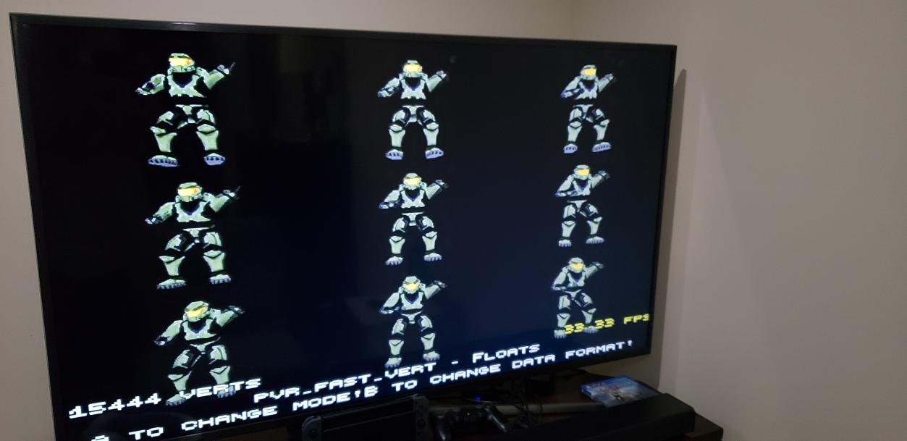
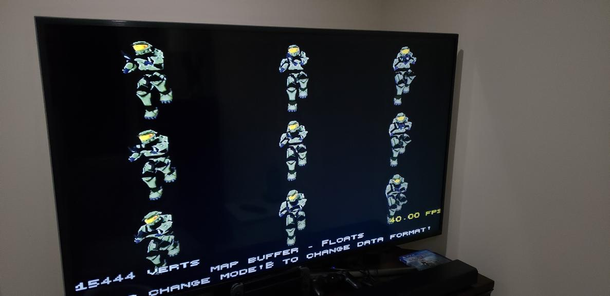

## Article Topics
- Why standard vec3f and indexed vertex formats are costly on Dreamcast hardware
- The fastpath vertex format: storing data in the final hardware-ready layout
- How to submit fastpath vertices to GLdc for static and dynamic geometry
- map_buffer: writing vertices directly into GLdc internal buffers to skip a copy
- Benchmark results comparing fastpath at 33 FPS against map_buffer at 40 FPS
- Rewriting a Quake water polygon renderer using fastpath and map_buffer

## Introduction

This article is going to focus on various techniques that are available under **[GLdc](https://gitlab.com/simulant/GLdc)** for you to use in order to render polygons on the Sega Dreamcast. It isn't going to be necessarily a tutorial on how to use OpenGL but it might help in writing rendering code and what formats to use. I will also mention what led to the thought process for each new technique and the gains that come with each.

## Immediate Mode Rendering

Not even discussed here because it has no reason to ever be used on any hardware for any reason. Even in the very first revision of OpenGL, vertex arrays and such were very supported and allowed.

**Do not use immediate mode on Sega Dreamcast**

But! if you do, internally behind the scenes it will get processed into fastpath so that's a bonus. (More on fastpath later)

## Vec3f and Friends

One of the most common ways to store vertices under OpenGL would be to store a large array of floats that might optionally be stored in triples. Something very similar to this `typedef vec3f float[3]`, and all of these 3D coordinates would be stored either in order of rendering for each triangle or as a large array to be used with an index to reuse and lower memory. This type of storage could leave you with a string of 3D coordinates defining two triangles, with every 3 vertices defining a triangle.

```c
{ {0, 0, 1}, {0, 0, 0}, {1, 1, 1}, {0, 0, 1}, {0, 0, 0}, {0, 0, 1} }
```

This format is very simple logically to think about and is very simple to submit to OpenGL, then internally it is very simple to render as well.

Another very similar format but with different storage and memory (and also runtime!) implications is using indexed arrays. Instead of a single large array you instead use two smaller arrays that define your vertex attributes (position only in this case) and then the order that these attributes should be reconstituted. In replicating the above example your positions array would be `{ {1, 1, 1}, {0, 0, 0}, {0, 0, 1} }` which is only storing 3 vertices, and then your index array would have `{2, 1, 0, 2, 1, 2}`; when both are submitted together OpenGL would be able to recreate the above array.

These work fine on the Dreamcast but the issue is that on the backend of GLdc lots of data moving and juggling has to be performed in order to turn this simple data into the appropriate format to submit to the hardware.

**The short of it**

- Using this simple format can get you off the ground quickly and can be shared between traditional desktop and Dreamcast rendering code.
- You will have a second copy of your data stored in memory for every vertex right before rendering.
- **Especially** if you use indexed arrays, GLdc will have to rebuild the original array before rendering every single frame. All your memory savings are instantly wiped out and you've introduced additional processing overhead for every draw call.

## The Initial Breakthrough: Fastpath

The whole idea of fastpath is that whenever you want to turn arbitrary data into OpenGL vertex data you do so into the format required internally by Dreamcast hardware. A simple idea but one that wasn't prevalent from what I could tell. This idea was first introduced in **[my bleeding edge fork of GLdc](https://gitlab.com/HaydenKow/GLdc)** with the goal of using it in **[nuQuake](https://gitlab.com/HaydenKow/nuquake)**.

This concept of creating vertex data in the final format that it will ultimately be consumed in had huge speed benefits at the cost of every vertex ballooning up to 32 bytes! The cost of spending more memory in order to save on processing time is definitely a great debate but on a 200 MHz CPU anywhere you can save processing time is a fantastic victory. All of my projects since the first nuQuake experiments now utilize the remnants of the original fastpath idea, and the code was expanded and incorporated soon after into the GLdc upstream repo.

**What does this look like?**

At the heart of the fastpath idea is that we are submitting data that can be directly used by the hardware PVR chip and eventually the TA CORE. This is achieved by storing/creating our data in the final format then setting up our OpenGL state so that we can quickly verify that this type of data is being submitted. Finally on the GLdc side we do a single fast store queue copy (very fast!) of the data right into our internal buffers then carry on. None of this data is touched beyond perspective calculations if you do not have lighting enabled.

My common struct type is PVR Polygon Type 4:

```c
typedef struct __attribute__((packed, aligned(4))) dc_fast_t {
  uint32_t flags;
  struct vec3f_gl vert;
  uv_float texture;
  color_uc color;  // bgra
  union {
    float pad;
    unsigned int vertindex;
  } pad0;
} dc_fast_t;
```

This is a versatile 32-byte vertex that supports: vertex position in 3D space, texture UV coordinates, and a diffuse color. The breakdown is as follows:

- An unsigned enum that specifies the type of vertex: Vertex or Vertex that ends a triangle strip
- 3 floats that define the position in 3D space
- 2 floats that define traditional UV coordinates
- 4 bytes in BGRA8888 format for a diffuse color
- 4 bytes of padding that can be used for any purpose and are ignored by hardware

**How do I use it?**

```c
dc_fast_t *vertexData;
glVertexPointer(3, GL_FLOAT, sizeof(glvert_fast_t), &vertexData->vert);
glTexCoordPointer(2, GL_FLOAT, sizeof(glvert_fast_t), &vertexData->texture);
glColorPointer(GL_BGRA, GL_UNSIGNED_BYTE, sizeof(glvert_fast_t), &vertexData->color);
glDrawArrays(GL_TRIANGLES, 0, num_indices);
```

How to draw a quad using fastpath:

```c
/*
1----2
|    |
|    |
4----3
Strip Order: 1423
*/

glvert_fast_t quadvert[4];

//Vertex 1
quadvert[0] = (glvert_fast_t){
  .flags = VERTEX,
  .vert = {10, -100, 100},
  .texture = {0, 1},
  .color = {(color[2] * 255), (color[1] * 255), (color[0] * 255), (color[3] * 255)},
  .pad0 = {0}};

//Vertex 4
quadvert[1] = (glvert_fast_t){
  .flags = VERTEX,
  .vert = {10, -100, -100},
  .texture = {0, 1},
  .color = {(color[2] * 255), (color[1] * 255), (color[0] * 255), (color[3] * 255)},
  .pad0 = {0}};

//Vertex 2
quadvert[2] = (glvert_fast_t){
  .flags = VERTEX,
  .vert = {10, 100, 100},
  .texture = {0, 1},
  .color = {(color[2] * 255), (color[1] * 255), (color[0] * 255), (color[3] * 255)},
  .pad0 = {0}};

//Vertex 3
quadvert[3] = (glvert_fast_t){
  .flags = VERTEX_EOL,
  .vert = {10, 100, -100},
  .texture = {0, 1},
  .color = {(color[2] * 255), (color[1] * 255), (color[0] * 255), (color[3] * 255)},
  .pad0 = {0}};

glEnableClientState(GL_VERTEX_ARRAY);
glEnableClientState(GL_COLOR_ARRAY);
glEnableClientState(GL_TEXTURE_COORD_ARRAY);
glVertexPointer(3, GL_FLOAT, sizeof(glvert_fast_t), &quadvert[0].vert);
glTexCoordPointer(2, GL_FLOAT, sizeof(glvert_fast_t), &quadvert[0].texture);
glColorPointer(GL_BGRA, GL_UNSIGNED_BYTE, sizeof(glvert_fast_t), &quadvert[0].color);
glDrawArrays(GL_TRIANGLE_STRIP, 0, 4);
```

After the shock of reading that, let's dissect it. This rendering path is best used for static data but is also a great contender for dynamic data submitted each frame.

**Pros**

- Draws very fast
- Less data moving and processing than most other methods
- Works under Desktop and Dreamcast environments (great for testing!)

**Cons**

- Duplicates vertex data
- Can be tricky for some programmers to rewrite existing vertex code
- Relies on the user submitting correct and valid data

## An Extension to Fastpath: Map Buffer

**Warnings**

- The API and code presented here is currently in flux but at the time of writing will work for my GLdc fork.
- You need to be 100% sure you are submitting correct data (start with fastpath then move to this for additional speed) or your program will crash.
- For static unchanging data this will be slower than fastpath.

This idea was first suggested by Moopthehedgehog, a fantastically brilliant programmer who helped many of us write faster code and expose capabilities of the Dreamcast we craved for peak performance. It was suggested that we could save a copy and also duplication of vertex data if we generated vertices directly into the GLdc internal buffers. I quickly realized this was a fantastic idea because for dynamic data we were already generating it just in time each frame to *somewhere* then copying it immediately after, so why not skip that copy?

After figuring out how the system would work and tinkering in the GLdc internals for a couple of days **map_buffer** was born and immediately was introduced prolifically into the nuQuake codebase. With the addition of fastpath and now map_buffer in the places it mattered most, nuQuake was routinely hitting 60fps in most areas and in the e1m1 benchmark was up to **56fps** on a Sega Dreamcast from 1998.

**Show me how to use it!**

This addition gives you 2 new enums and a single call to utilize:

```c
#ifndef GL_EXT_dreamcast_direct_buffer
#define GL_EXT_dreamcast_direct_buffer 1

/* Enable flag */
#define GL_DIRECT_BUFFER_KOS                  0xEF01

/* for glGetIntegerV */
#define GL_DIRECT_BUFFER_ADDRESS              0xEF02

GLAPI void APIENTRY glDirectBufferReserve_INTERNAL_KOS(int count, int* buffer_ptr, GLenum mode);
#endif /* GL_EXT_dreamcast_direct_buffer */
```

**Without Code**

The basic usage is that you start with a pointer that when dereferenced will be the location you are storing vertex data in the `glvert_fast_t` format. This pointer should start as an index into a buffer you control that is large enough to store the entire set of vertex data you want to upload to OpenGL. After setting this pointer you will enable an OpenGL state then call `glDirectBufferReserve_INTERNAL_KOS` with the amount of verts you intend to upload, a pointer to your vertex data pointer, and the type of data, either `GL_TRIANGLE_STRIP` or `GL_TRIANGLES`. Then you will set up your GL pointer calls as usual but using your pointer, not a fixed buffer. After the pointer is used for setup you will loop through all of your vertices and generate vertex data where your pointer now points to. Finally a single draw call using the *exact* same type and count as you initially requested then you'll disable map_buffer.

If done correctly, when map_buffer support is not present you will gracefully degrade into fastpath, which is still an excellent situation to be in!

**Code Example**

```c
/* Total vertex count, and a temp var */
int count = 128; int c;

/* Pointer we will use to store generated verts */
glvert_fast_t *submission_pointer = &r_batchedtempverts[0];

#ifdef GL_EXT_dreamcast_direct_buffer
glEnable(GL_DIRECT_BUFFER_KOS);
glDirectBufferReserve_INTERNAL_KOS(count, (int *)&submission_pointer, GL_TRIANGLE_STRIP);
#endif

/* Setup our OpenGL pointers */
glVertexPointer(3, GL_FLOAT, sizeof(glvert_fast_t), &submission_pointer->vert);
glTexCoordPointer(2, GL_FLOAT, sizeof(glvert_fast_t), &submission_pointer->texture);
glColorPointer(GL_BGRA, GL_UNSIGNED_BYTE, sizeof(glvert_fast_t), &submission_pointer->color);

/* Generate vertex data in place in our internal GLdc buffers */
c = count;
do {
  *submission_pointer++ = (glvert_fast_t){
      .flags = VERTEX,
      .vert = {verts->v[0], verts->v[1], verts->v[2]},
      .texture = {((float *)order)[0], ((float *)order)[1]},
      .color = {.packed = PACK_BGRA8888(l, l, l, 255)},
      .pad0 = {0}};
  verts++;
} while (--c);
(*(submission_pointer - 1)).flags = VERTEX_EOL;

/* Draw it! */
glDrawArrays(GL_TRIANGLE_STRIP, 0, count);

#ifdef GL_EXT_dreamcast_direct_buffer
glDisable(GL_DIRECT_BUFFER_KOS);
#endif
```

## Benchmarks

- **fastpath with plain `glvert_fast_t`: 33.3 FPS**



- **map_buffer: 40 FPS**



---

## Comparison of a Sample Method from Quake

**id Original**

```c
void DrawGLWaterPolyLightmap (glpoly_t *p)
{
    int     i;
    float   *v;
    vec3_t  nv;

    GL_DisableMultitexture();

    glBegin (GL_TRIANGLE_FAN);
    v = p->verts[0];
    for (i=0 ; i<p->numverts ; i++, v+= VERTEXSIZE)
    {
        glTexCoord2f (v[5], v[6]);

        nv[0] = v[0] + 8*sin(v[1]*0.05+realtime)*sin(v[2]*0.05+realtime);
        nv[1] = v[1] + 8*sin(v[0]*0.05+realtime)*sin(v[2]*0.05+realtime);
        nv[2] = v[2];

        glVertex3fv (nv);
    }
    glEnd ();
}
```

**Fastpath + map_buffer Enabled Rewrite**

```c
void DrawGLWaterPolyLightmap (glpoly_t *p)
{
    int     i;
    float   *v;
    GL_DisableMultitexture();
    glvert_fast_t* submission_pointer = R_GetDirectBufferAddress();

    const float *v0 = p->verts[0];
    float pnv[3];
    float tv0, tv1;
    v = p->verts[1];

    pnv[0] = v0[0] + 8*SIN(v0[1]*0.05f+realtime)*SIN(v0[2]*0.05f+realtime);
    pnv[1] = v0[1] + 8*SIN(v0[0]*0.05f+realtime)*SIN(v0[2]*0.05f+realtime);
    pnv[2] = v0[2];

    for (i = 0; i < p->numverts - 2; i++)
    {
        tv0 = v[0] + 8*SIN(v[1]*0.05f+realtime)*SIN(v[2]*0.05f+realtime);
        tv1 = v[1] + 8*SIN(v[0]*0.05f+realtime)*SIN(v[2]*0.05f+realtime);

        *submission_pointer++ = (glvert_fast_t){.flags = VERTEX, .vert = {pnv[0], pnv[1], pnv[2]}, .texture = {v0[5], v0[6]}, VTX_COLOR_WHITE, .pad0 = {0}};
        *submission_pointer++ = (glvert_fast_t){.flags = VERTEX, .vert = {tv0, tv1, v[2]}, .texture = {v[5], v[6]}, VTX_COLOR_WHITE, .pad0 = {0}};
        v += VERTEXSIZE;

        tv0 = v[0] + 8*SIN(v[1]*0.05f+realtime)*SIN(v[2]*0.05f+realtime);
        tv1 = v[1] + 8*SIN(v[0]*0.05f+realtime)*SIN(v[2]*0.05f+realtime);
        *submission_pointer++ = (glvert_fast_t){.flags = VERTEX_EOL, .vert = {tv0, tv1, v[2]}, .texture = {v[5], v[6]}, VTX_COLOR_WHITE, .pad0 = {0}};
    }
}
```

## Wrap Up

I hope all of this information helps you to write better performing code on the Dreamcast using Kazade's amazing GLdc. Fastpath should be your first goal when writing new rendering code or if you are rewriting yours for efficiency. Please acknowledge that the code for some previously simple methods will grow by many lines and complexity. Rest assured the speed gains are there if you put in this work.
