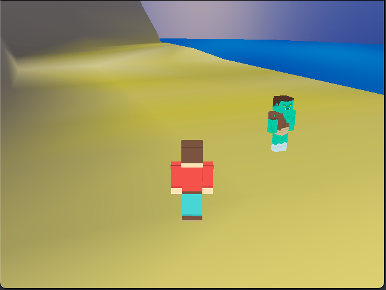

\#now

## Personal
Currently working on learning on how to build oak shelves, never liked those white wire shelves.
Recently adopted a puppy from the streets of Mexico and working with him to grow him into the beautiful dog he is.

## Hobby
Just released huge updates to my hobby retro game engine and planning on building an entire game in it. 
This engine has been a way to for me to explore and better understand older hardware in a fun way while playing with multimedia.
Easily write once in classic c99 (really c17 but only because of struct initializers), and run on Dreamcast, PSP and Desktop.

- Sneak peek of the opening scene, Built with [integrity](https://github.com/HaydenKowalchuk/integrity)

## Work

Managing automating an entire new part of a state of the art heavy industry factory. Using the latest c# and dotnet can offer along with modern software engineering.
Its very fun to greenfield and entire ecosystem of apps to get data, flow data, record data, and manage data. This will likely extend into the next 2 years of my professional life.
